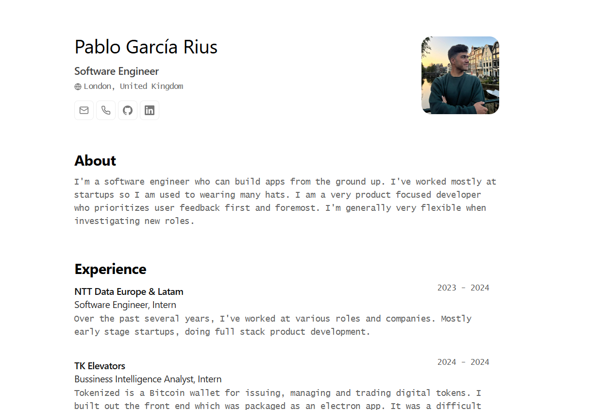

<div align="center">
  <h2>
    Minimalist Resume Built for <b>Web</b> and <b>PDF</b>
  </h2>
  <p>
    JSON schema source: <a href="https://jsonresume.org/schema/">jsonresume.org</a>
  </p>
  <p>
    Based on the design by <a href="https://github.com/BartoszJarocki/cv">Bartosz Jarocki</a>, inspired by the guide from <a href="https://github.com/midudev/minimalist-portfolio-json">MiduDev</a>.
  </p>
</div>

---

<div align="center">
  <a href="#-first-steps">First Steps</a>
  <span>&nbsp;✦&nbsp;</span>
  <a href="#-commands">Commands</a>
  <span>&nbsp;✦&nbsp;</span>
  <a href="#-license">License</a>
  <span>&nbsp;✦&nbsp;</span>
  <a href="https://pablo-garcia-rius.vercel.app/">Personal</a>
</div>

---

<div align="center">


</div>



## 🛠️ Stack

- [**Astro**](https://astro.build/)
- [**Typescript**](https://www.typescriptlang.org/)
- [**Hotkeypad**](https://github.com/jesubohr/hotkeypad)

## 🚀 First steps

### 1. Using this [repo](https://github.com/PabloRius/JSON-portfolio) as a _template_ for your new Astro project

```bash
npm create astro@latest -- --template PabloRius/JSON-portfolio
```

### 2. Add your own information:

Edit the file `resume.json` to create your own web-based and printable portfolio.

### 3. Run your development server:

```bash
npm run dev
```

1. Open [**http://localhost:4321**](http://localhost:4321/) on your browser to see the results 🚀

## 🧞 Commands

|     | Command         | Action                                                            |
| :-- | :-------------- | :---------------------------------------------------------------- |
| ⚙️  | `dev` o `start` | Runs a local development server on `localhost:4321`.              |
| ⚙️  | `build`         | Checks for errors and packs the code for production on `./dist/`. |
| ⚙️  | `preview`       | A local preview `localhost:4321`                                  |
| ⚙️  | `sync   `       | Runs a syncronization process to fix dependencies                 |

## 🔑 License

[MIT](LICENSE.txt) - Creado por [**Pablo García Rius**](https://pablo-garcia-rius.vercel.app/).
